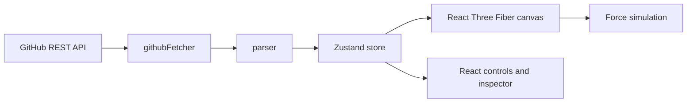

# DevPulse

An interactive 3D map for understanding a JavaScript or TypeScript repository.
DevPulse ingests a public GitHub repository, resolves its internal imports, and
turns the resulting dependency graph into a navigable Three.js scene.

Built as a portfolio project to demonstrate practical frontend engineering:
data ingestion, graph modeling, real-time visual rendering, resilient UI state,
and a tested TypeScript codebase.

## Why It Exists

Large repositories make architecture difficult to explain in a pull request,
interview, or onboarding session. DevPulse offers a fast visual starting point:
which files exist, how they connect, which modules are heavily referenced, and
where to investigate next.

It is intended for software engineers, technical leads, developer advocates,
and interviewers who want a compact, interactive way to explore a codebase.

## Highlights

- Ingests public GitHub repositories with `main`/`master` fallback.
- Limits files to JavaScript and TypeScript sources smaller than 50 KB, with a
  configurable fetcher cap of 150 files. The unauthenticated UI uses 50 files
  so a first-time visitor stays within GitHub's public API request allowance.
- Shows friendly loading and GitHub rate-limit feedback without losing the
  currently visible graph.
- Models files as color-coded nodes: spheres for modules and cubes for React
  components; node size reflects non-blank lines of code.
- Simulates layout using repulsion, spring links, centering, damping, and a
  velocity cap for stable interaction.
- Supports mouse and touch camera controls with a responsive bottom-sheet
  inspector on narrow screens.
- Includes an AI architecture-review interaction with a safe mock fallback.

## Architecture



- **Ingestion**: `src/utils/githubFetcher.ts` calls the GitHub tree and
  contents endpoints, filters source files, decodes Base64, bounds concurrency,
  and surfaces rate-limit reset times through `GitHubRateLimitError`.
- **Graph construction**: `src/utils/parser.ts` resolves relative imports into
  typed nodes and edges. It intentionally ignores external package imports.
- **State**: `src/store/useAppStore.ts` coordinates graph data, selection,
  loading, and error states. Physics fields mutate directly to avoid React
  re-renders on every frame.
- **Rendering**: `src/components/Canvas3D.tsx` uses React Three Fiber, Drei,
  and Three.js. `useGraphLayout.ts` applies deterministic force simulation.
- **Experience**: React, Tailwind, Framer Motion, and Lucide provide animated
  loading/error states, responsive controls, and accessible interaction.

## Run Locally

```bash
npm install
npm run dev
```

Open the local URL printed by Vite. Start with the included sample graph, or
enter a public GitHub owner and repository such as `lukeed / clsx`.

## Quality Checks

```bash
npm run test
npm run test:coverage
npm run verify
```

`npm run verify` runs Vitest with coverage thresholds, strict TypeScript
checking, and a production build. The test suite covers the parser, force
simulation, GitHub client, sidebar interaction, and canvas mounting.

## Constraints And Next Steps

- Public GitHub API requests are unauthenticated by design, so a session may
  hit GitHub's hourly rate limit. DevPulse displays the local reset time and
  preserves the graph already on screen.
- Import extraction currently uses a lightweight regex. An AST parser is the
  natural next step for dynamic imports, type-only imports, and every syntax
  edge case.
- Pixel-level 3D visual regression testing is outside the unit suite; add
  Playwright screenshots if visual stability becomes a release requirement.
